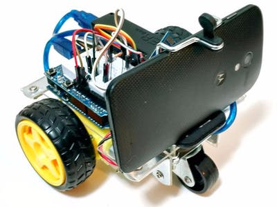
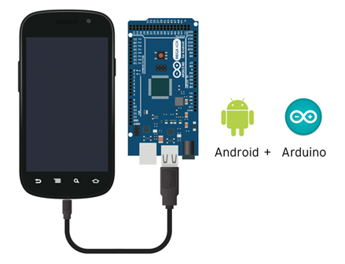
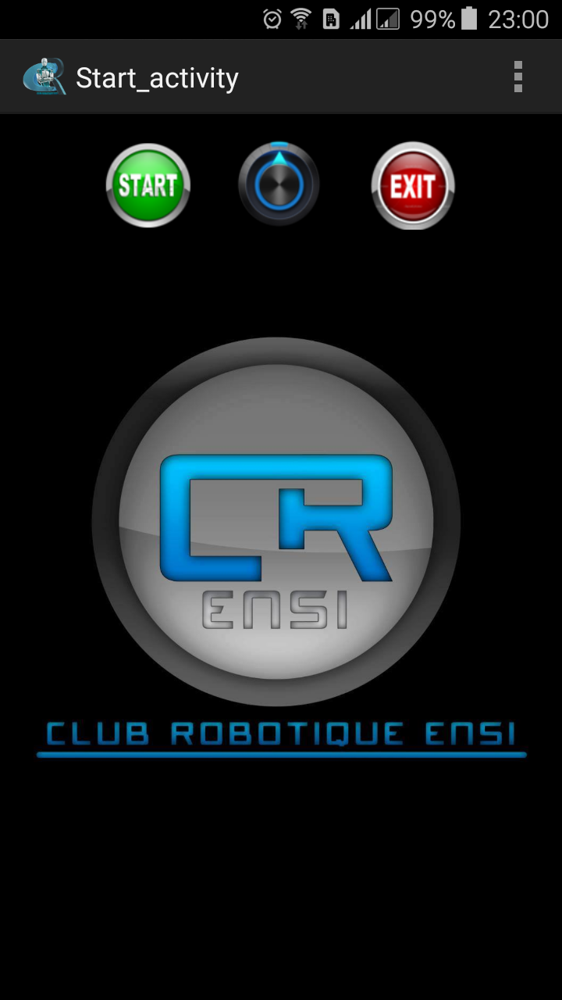
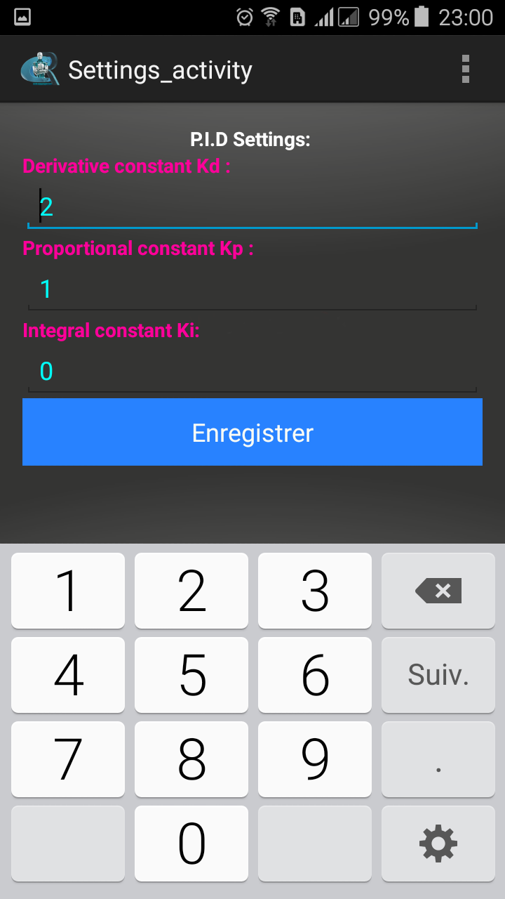
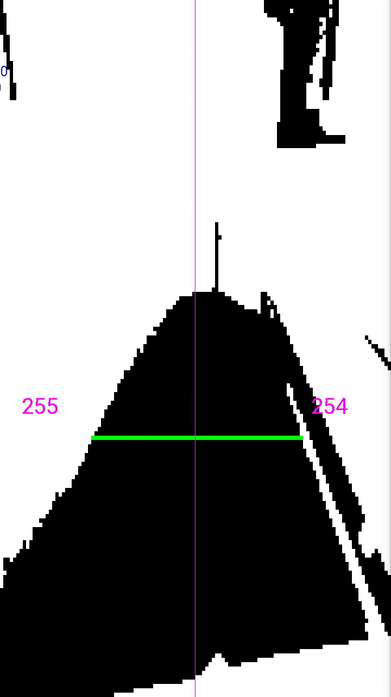
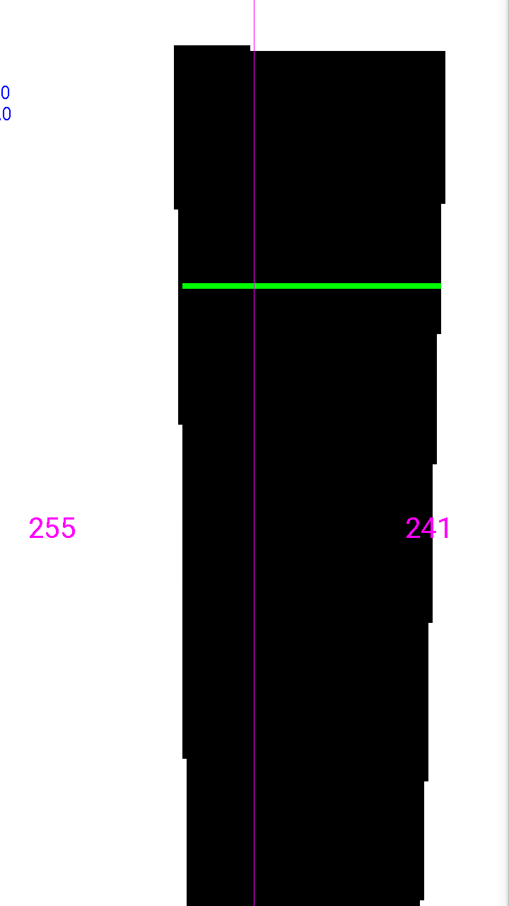
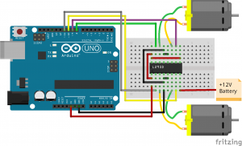

# Android Line Follower Robot
An autonomous Line follower Robot.
The Robot is based on an Arduino SDK board that interface with an Android Smartphone.
An Android app uses image processing to detect the line to follow and then calculate the correct PWM signal to send to the motors using a PID control system.

The Android app contains a settings menu that allow control of:
  - PID settings: Proportional, Integral and Derivative values.
  - Turn On/Off the flash light.
  - Choose the background color ( clear or dark ).
  - Limit the maximum motors speed.
  
 

# Eletrical Components:
The Robot is composed of:
 - An Android smartphone with the Line Follower app installed.
 - An arduin Mega ADK board.
   - More Info: https://www.arduino.cc/en/Main/ArduinoBoardMegaADK?from=Main.ArduinoBoardADK
 - One H-bridge motor driver.
   - Reference: L293D
   - Datasheet: Android-Line-Follower-Robot\Datasheets\L293D.pdf 
 - Two DC Motors.
-  One 9 V Battery.

# Screen Shots from the app:
Prebuilt app: Android-Line-Follower-Robot\Line_Follower.apk

    

    

# Wiring Components:
   
   The Motors:
   
   
   
   
